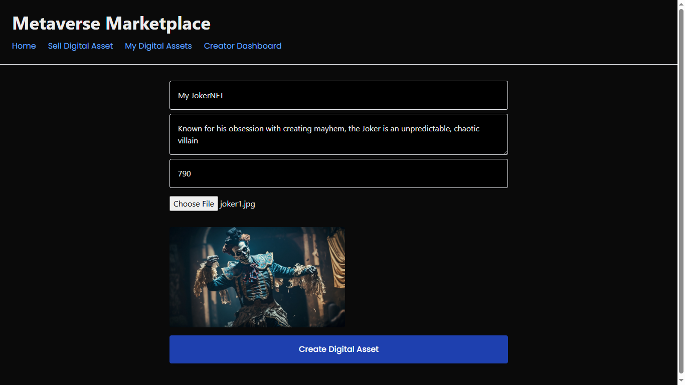
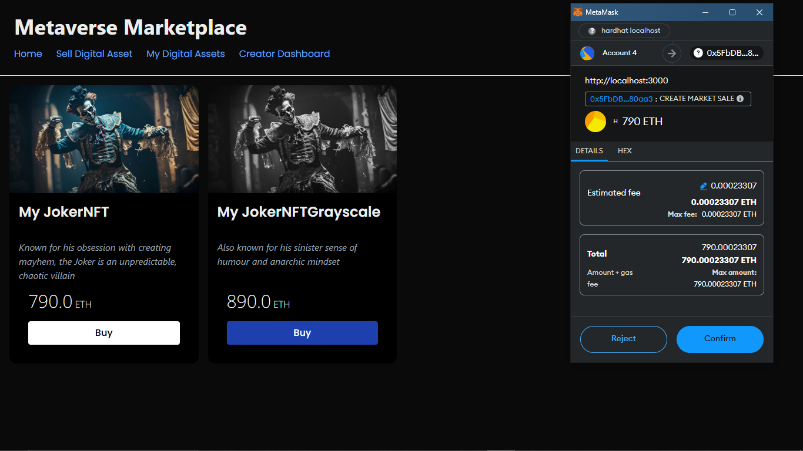
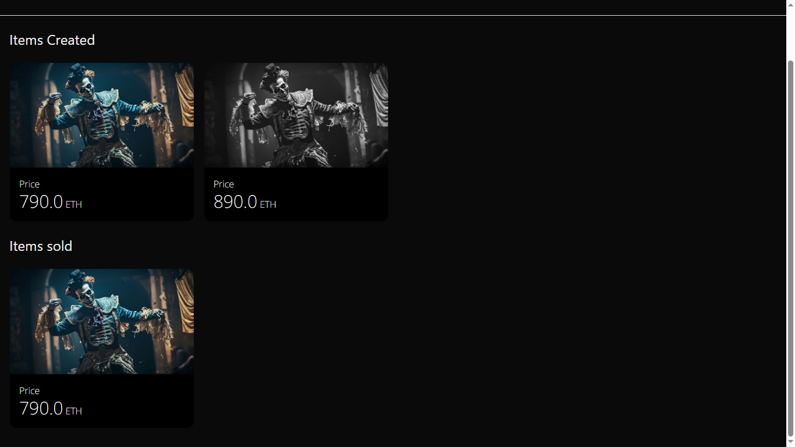

# Nextjs-NFT-Marketplace

This project is a decentralized NFT marketplace built on the Ethereum blockchain. Users can buy and sell NFTs through the platform. The platform uses [Next.js](https://nextjs.org) for a responsive frontend, [Polygon](https://polygon.technology/) as the Layer 2 solution for faster and cheaper transactions, and [Pinata](https://pinata.cloud/) for decentralized IPFS-based storage of NFT metadata and assets.

## Sell Digital Asset



## Buying NFT



## Items Created & Sold



## Getting Started

First, run the hardhat node:

```bash
npx hardhat node
```

Then, deploy your contracts to localhost network

```bash
npx hardhat run scripts/deploy.js --network localhost
```

Update the contract addresses in [nftmarket.config.js](./nftmarket.config.js) with the contract addresses in your terminal

Now, run the development server

```bash
npm run dev
```

Open [http://localhost:3000](http://localhost:3000) with your browser to see the result.

## Learn More

To learn more about Next.js, take a look at the following resources:

- [Next.js Documentation](https://nextjs.org/docs) - learn about Next.js features and API.
- [Learn Next.js](https://nextjs.org/learn) - an interactive Next.js tutorial.

You can check out [the Next.js GitHub repository](https://github.com/vercel/next.js) - your feedback and contributions are welcome!

## Deploy on Vercel

The easiest way to deploy your Next.js app is to use the [Vercel Platform](https://vercel.com/new?utm_medium=default-template&filter=next.js&utm_source=create-next-app&utm_campaign=create-next-app-readme) from the creators of Next.js.

Check out our [Next.js deployment documentation](https://nextjs.org/docs/app/building-your-application/deploying) for more details.

## Disclaimer

>These smart contracts and the accompanying web application are provided "as is." No guarantee, representation, or warranty is made, express or implied, regarding the safety, correctness, or functionality of the user interface or the smart contracts. They have not undergone any formal audit, and therefore, there is no assurance that they will operate as intended. Users may encounter delays, failures, errors, omissions, or loss of transmitted information. Ritesh Das is not liable for any of the aforementioned issues or for any losses incurred. Users are advised to proceed with caution and use the application ONLY on localhost or a testnet such as Polygon Amoy, and NOT the mainnet.